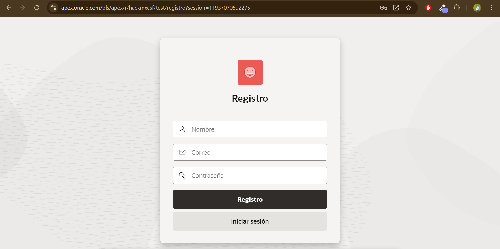
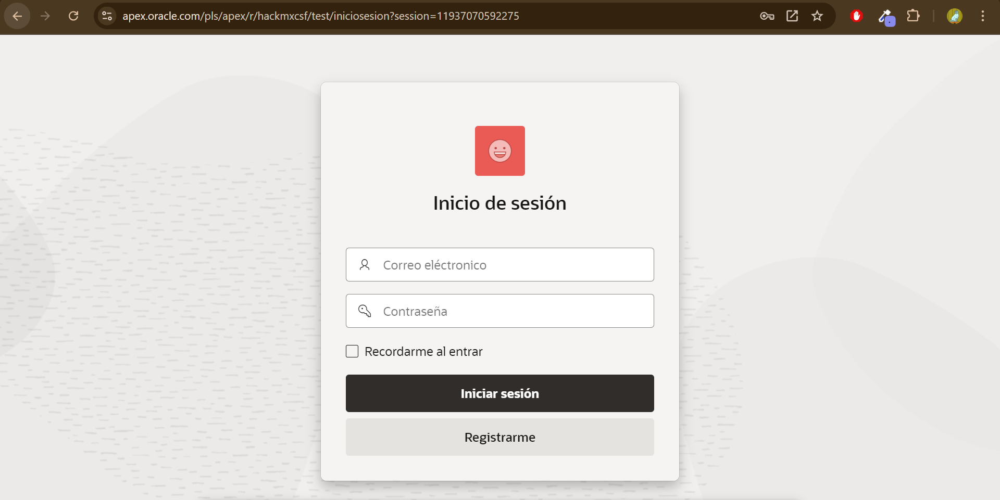
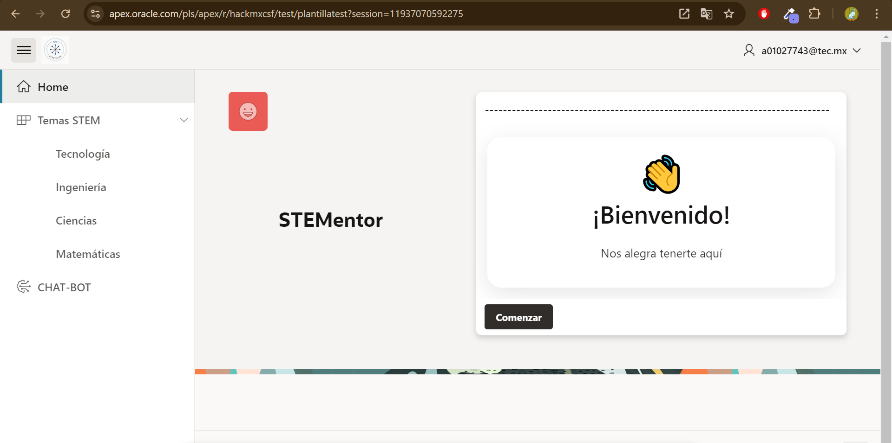

>[!IMPORTANT]
>CREDENCIALES PARA ENTRAR A LA APLICACIÓN

- **[Link a la aplicación](https://apex.oracle.com/pls/apex/r/hackmxcsf/test/iniciosesion?session=16177794563327)**

- **Usuario: a01029811@tec.mx**

## **Contraseña: 52811040305MpH@**

## **MANUAL DE USARIO**
- El usuario entre a la aplicación y en caso de no tener un perfil creado, puede crear uno.

- Cuando ya tiene una cuenta, ahora puede iniciar sesión.

- Una vez dentro de la plataforma, el usuario puede consultar los cursos que tiene por cada Area.

- En caso de tener una duda, puede presionar el Chat-Bot que se encuentra en la barra lateral izquierda para consultar la inteligencia artificial.

